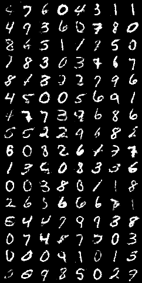
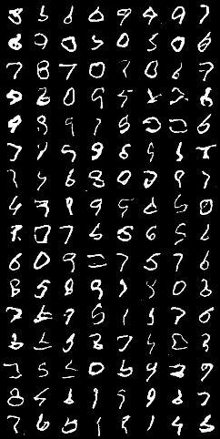
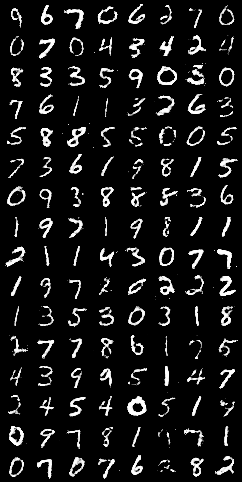
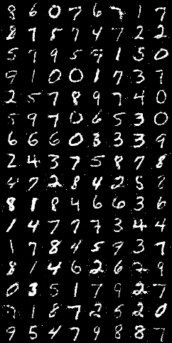

# GANs-Papers Repository
## Brief Introduction

This repository explores the implementation of various Generative Adversarial Network architectures. The project's objective is to replicate and analyze key early models from the GAN literature. At the end of the file, there is a list of some of the most relevant papers.  
There are three main implementations: GANs with Maxout units, DCGANs which rely on a convolutional architecture, and Conditional GANs that leverage discrete inputs to condition the output distribution. The Conditional GANs are tested with fully connected layers as well as with Maxout units.  
The evaluation process involves a mixture of manual inspection by looking at the samples, as well as tracking training losses, gradient magnitudes, and some specific metrics such as FID Score and Inception V3 Score. The Points for Future Work and Improvements section provides next steps for further exploration.  

--- 

## General Setup

This repository contains four main branches that each train a different GAN model. We use UV as our package manager to ensure consistent dependency management across branches. The first section of this README explains how to set up the environment, train the model, and launch the Streamlit app. The second section will explain in more detail the content of each branch and share some results on the MNIST dataset.

### 1. Clone the Repository

Clone the repository and move it to the repository directory:

```bash
git clone git@github.com:LuisguiPizana/gans-paper.git
cd GANs-Paper
```

### 2. Install UV

Dependencies and environments are managed through UV. You can install it with pip.
```bash
pip install uv
```

### 3. Installing Dependencies
There is no need to create a virtual environment manually; UV will automatically handle it by creating the .venv folder in your repository. Just run:
```bash
uv sync
```

If you prefer, you can also create your own environment and activate it. In this case, make sure your environment is active before running the previous command.

### 4. Training the Model
In order to train the model, run the following command from your repository root:
```bash
uv run ./src/train.py --config ./config/config.json
```

### 5. Training Evaluation and Experiment Tracking

To launch the Streamlit experiment tracking app, run:
```bash
uv run streamlit run ./metric_dashboard/app.py
```
The functionalities of this custom experiment tracking are limited. Feel free to use another tool like MLFlow or TensorBoard instead.

Apart from the losses coming from the training functions of the generator and the discriminator, as well as the gradient magnitudes and variance, I also tracked metrics like Inception V3 Score and FID Score.

- **Inception V3 Score**: This metric evaluates the quality of generated images by using a pre-trained Inception V3 model. It measures how realistic the generated images are by comparing them to real images from the dataset.

- **FID Score (Fréchet Inception Distance)**: The FID Score compares the distribution of generated images to the distribution of real images. A lower FID Score indicates that the generated images are more similar to the real images, both in terms of visual quality and diversity.

--- 

## General Idea of a GAN Architecture

Generative Adversarial Networks (GANs) consist of two neural networks: a generator and a discriminator. The generator creates fake data resembling real samples, while the discriminator evaluates them along with real data. These networks are trained in opposition, where the generator improves its ability to produce realistic data and the discriminator sharpens its skills in distinguishing fake from real. This adversarial process is defined through a minimax game driving both networks toward better performance over time. In the original paper (and also in this project), the loss functions measure the log-likelihood of the data being correctly classified.  

The Discriminator Loss encompasses two parts: the "Real Loss," which evaluates how well the model learns to classify data from the original distribution, and the "Fake Loss," which measures the capacity of the model to distinguish samples generated by the generator.  
The Generator Loss purely focuses on the ability to trick the Discriminator into classifying the generated images as real.  
The loss function that defines the optimization problem of the minimax game joins the Discriminator and the Generator Losses.

## Experiments on Branches

All the experiments were done using the MNIST dataset. The objective of the project was to test four different architectures presented in the GAN's literature, these being: the original architecture from the Generative Adversarial Nets paper, the DCGAN, the Conditional GAN using Maxout Units, and a Conditional GAN using Dense Layers.

### 1. Original GAN with Maxout Units
An approximation of the original GAN paper with a few changes. This architecture incorporates batch normalization during training and uses Leaky ReLU activation functions. Additionally, it integrates Maxout units in the discriminator to improve feature extraction and enhance stability.



### 2. DCGAN
This architecture follows the Deep Convolutional GAN design as described in "Unsupervised Representation Learning with Deep Convolutional Generative Adversarial Networks". It employs convolutional layers in both the generator and discriminator with batch normalization.



### 3. Conditional GAN With Dense Layers
An approximation of the Conditional Generative Adversarial Nets paper. In this architecture, both the generator and the discriminator use dense (fully connected) layers enhanced with batch normalization. The conditional approach is implemented by concatenating label information with input noise for the generator and by integrating label conditioning in the discriminator, allowing for more targeted image generation.

  
Training Sample - Dense Conditional GAN Architecture

### 4. Conditional GAN With Maxout Units
This architecture also follows the conditional GAN approach but modifies the discriminator by incorporating Maxout units, similar to the adaptations in the original GAN architecture. While the generator still relies on dense layers, the discriminator's use of Maxout is intended to better capture complex features, potentially leading to more effective adversarial training.



### Training and Results

#### Training
Training the models is a complicated task. I would like to point out three key aspects to consider when balancing the training:
  1. **Discriminator Power**: If the discriminator is too powerful, it might prevent the generator from learning effectively by providing signals that are not useful for gradual learning.
  2. **Discriminator Weakness**: A weak discriminator will not push the generator to reach its full potential, resulting in suboptimal generated images.
  3. **Generator Capacity**: The generator must have enough units to effectively generate patterns. Insufficient capacity can lead to poor-quality images.

I tested several techniques to achieve training stability and improve the quality of the results. These techniques were inspired by the literature:
  1. **Adding Gaussian Noise to Internal Representations**: In order to improve generalization and prevent overfitting, Gaussian noise was added to internal layers of the discriminator. This was mainly done for the non-convolutional architectures, and several noise intensities were tested. This technique was particularly helpful in the Conditional GANs; adding noise to the label embedding layers enabled the model to gain information on the required number while focusing on image quality rather than the categorical input.
  2. **Dropout and LeakyReLU Activations**: Dropout, in particular, works well with Maxout units by forcing the units to generate relevant non-max outputs. When the maximum outputs are dropped, other values will generate the necessary signals. LeakyReLU activation functions help maintain gradient flows even for small negative inputs.
  3. **Batch Normalization**: Even though this technique was developed after the initial GAN paper, it helped stabilize training by reducing the internal covariate shift. In GANs tiny imbalances might lead to instability.
  4. **Soft Labels for the Discriminator**: Instead of using 1 for true and 0 for false samples, I tested values in the ranges of (0.7, 1) and (0, 0.3) respectively. This technique reduces the certainty of the discriminator, giving more time for the generator to adapt and learn.

#### FID and Inception Scores
<!-- Insert table of metrics below -->
| Architecture                      | FID Score | Inception Score |
|-----------------------------------|-----------|-----------------|
| Original GAN with Maxout Units    | 304.8     | 2.89            |
| DCGAN                             | 263.96    | 2.22            |
| Conditional GAN With Dense Layers | 163.65    | 2.68            |
| Conditional GAN With Maxout Units | 227.05    | 2.70            |

We can see that the FID Scores of the Conditional architectures are, in general, lower than those of the Original GAN and the DCGAN. This effect might be caused by the fact that in the last two architectures we are forcing the output number through uniform label generation, resulting in an output distribution similar to that of the MNIST dataset. The results also suggest that the distributions are collapsing during training, and further refinement needs to be done.

The highest Inception Scores are achieved by the architectures using Maxout layers. Although this may not be clearly visible from the provided samples due to the present noise, it suggests that these units help the model capture relevant features and specific traits which are also significant for the Inception V3 model.

The DCGAN architecture requires more attention in order to achieve better image quality. This is also visible in the sample provided, and further adjustments are required to achieve improved results.

## Points for Future Work and Improvements

There are several areas where this project can be improved and expanded upon:

- **Further Inspection in Architectures and Hyperparameter Selection**: As mentioned before, it is crucial to balance the training of the generator and the discriminator. Tuning the hyperparameters with more attention could provide a significant uplift in performance.

- **Testing Architectures with More Complex Datasets**: Future work should involve testing the architectures with more complex datasets, including color images and larger training sets. The increased complexity may necessitate more sophisticated architectures to achieve better results.

- **Improve the Codebase by Generating a Single Branch with All Architectures**: Managing multiple branches for different architectures can be cumbersome. Consolidating all architectures into a single branch would streamline the process of training and comparing different models, making the workflow more efficient.

- **Exploring Alternative Loss Functions**: Test Wasserstein GANs, which mainly use the Earth Moving Distance loss, and also a Least Squares loss function. These alternatives could provide different gradients, which might help stabilize training.

- **Incorporating Self-Attention Mechanisms**: Explore the integration of self-attention mechanisms in the architectures. Adding attention layers may help capture long-range dependencies and improve the quality of generated images.

## Related Literature

- [Generative Adversarial Networks](https://arxiv.org/pdf/1406.2661)
- [Unsupervised Representation Learning with Deep Convolutional Generative Adversarial Networks](https://arxiv.org/pdf/1511.06434)
- [Conditional Generative Adversarial Nets](https://arxiv.org/pdf/1411.1784)
- [Improved Techniques for Training GANs](https://arxiv.org/pdf/1606.03498)
- [Maxout Networks](https://arxiv.org/pdf/1302.4389)
- [Wasserstein GAN](https://arxiv.org/pdf/1701.07875)
- [Least Squares Generative Adversarial Networks](https://arxiv.org/pdf/1611.04076)
